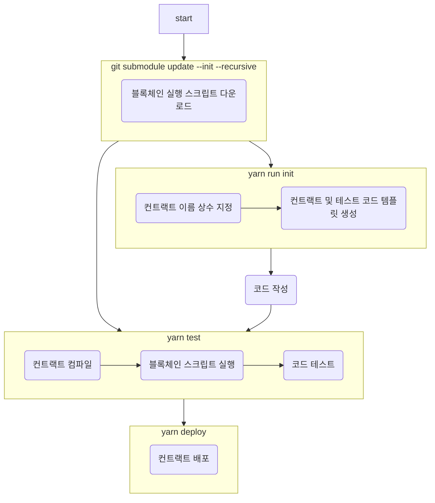

```mermaid
flowchart TB
  insert_constants(컨트랙트 이름 상수 지정)
  init_code_template(컨트랙트 및 테스트 코드 템플릿 생성)
  get_blockchain_scripts(블록체인 실행 스크립트 다운로드)
  execute_blockchain_scripts(블록체인 스크립트 실행)
  compile_contracts(컨트랙트 컴파일)
  deploy_contracts(컨트랙트 배포)
  test_code(코드 테스트)
  write_code(코드 작성)


	subgraph A [git submodule update --init --recursive]
	  get_blockchain_scripts
  end
  subgraph B [yarn run init]
  	insert_constants --> init_code_template
  end
  write_code
	subgraph C [yarn test]
  	compile_contracts --> execute_blockchain_scripts
	  execute_blockchain_scripts --> test_code
	end
	subgraph D [yarn deploy]
		deploy_contracts
	end

	start --> A
  A --> B
  A --> C
	B --> write_code
	write_code --> C
	C --> D

```

